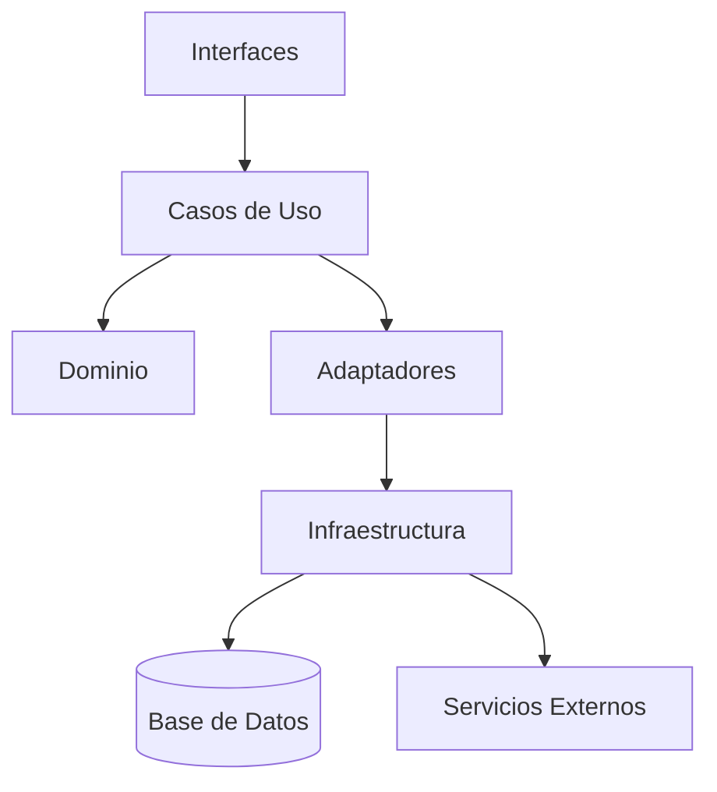
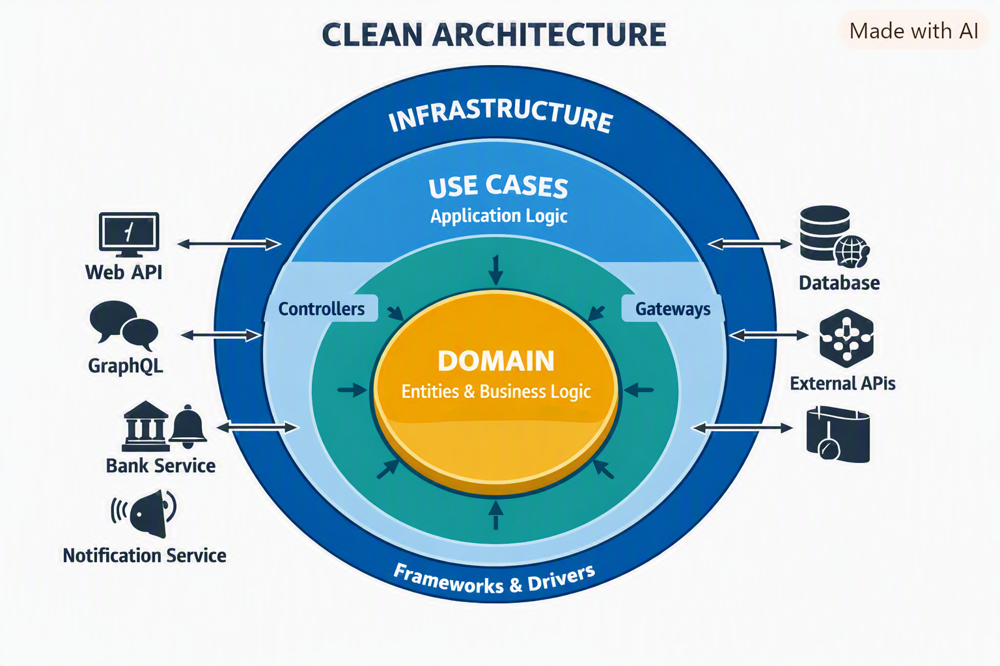
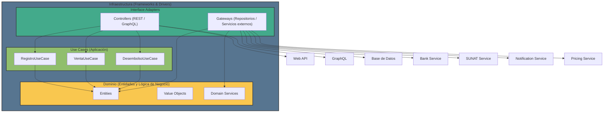
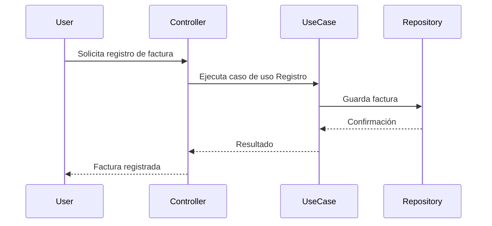
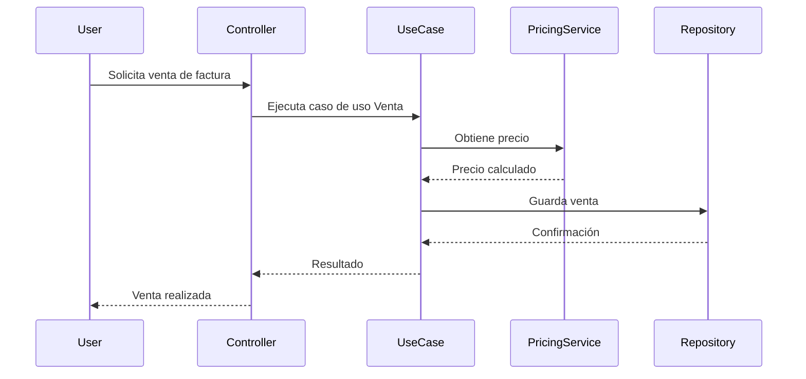
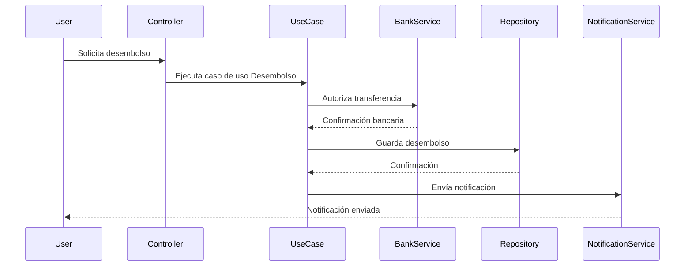

# Proyecto de Factoring con Clean Architecture

## 📑 Índice
- [Explicación del Sistema de Factoring](#explicación-del-sistema-de-factoring)
- [Casos de Uso](#casos-de-uso)
  - [Registro](#registro)
  - [Venta](#venta)
  - [Desembolso](#desembolso)
- [Capas de la Arquitectura](#capas-de-la-arquitectura)
  - [Dominio](#dominio)
  - [Aplicación](#aplicación)
  - [Adaptadores](#adaptadores)
  - [Infraestructura](#infraestructura)
- [Modelo de Datos](#modelo-de-datos)
- [Diagrama de Capas](#diagrama-de-capas)
- [Diagramas de Secuencia](#diagramas-de-secuencia)
  - [Registro](#registro-1)
  - [Venta](#venta-1)
  - [Desembolso](#desembolso-1)
- [Explicación del Docker Compose](#explicación-del-docker-compose)
- [Estructura del Proyecto y Archivos](#estructura-del-proyecto-y-archivos)
- [Sustento de Clean Architecture](#sustento-de-clean-architecture)
- [Comparación entre Onion, Hexagonal y Clean Architecture](#comparación-entre-onion-hexagonal-y-clean-architecture)

---

## 📘 Explicación del Sistema de Factoring
El sistema de factoring permite a las empresas vender sus cuentas por cobrar (facturas) a una entidad financiera (factor) para obtener liquidez inmediata.  
El proceso involucra:
- **Registro** de facturas.
- **Venta** de las facturas al factor.
- **Desembolso** del dinero al cliente.

---

## ⚙️ Casos de Uso

### Registro
- Validación de datos de la factura.
- Asociación con cliente y empresa.
- Persistencia en base de datos.

### Venta
- Evaluación de riesgo y precio.
- Transferencia de la factura al factor.
- Generación de contrato de factoring.

### Desembolso
- Autorización bancaria.
- Transferencia de fondos al cliente.
- Notificación de operación completada.

---

## 🏗️ Capas de la Arquitectura

### Dominio
- Entidades: `Factura`, `Cliente`, `Empresa`.
- Value Objects: `RUC`, `Monto`.
- Servicios de negocio: validaciones, pricing.

### Aplicación
- Casos de uso: `RegistroUseCase`, `VentaUseCase`, `DesembolsoUseCase`.
- Orquestación de reglas de negocio.

### Adaptadores
- Entrada: controladores REST/GraphQL.
- Salida: integración con bancos, SUNAT, servicios de notificación.

### Infraestructura
- Configuración de base de datos.
- Repositorios.
- Servicios externos (pricing, notificaciones).

---

## 🗄️ Modelo de Datos
Ejemplo simplificado:

- **Cliente**(id, nombre, ruc, email)  
- **Factura**(id, cliente_id, monto, fecha_emisión, fecha_vencimiento, estado)  
- **Venta**(id, factura_id, precio, fecha_venta)  
- **Desembolso**(id, venta_id, monto, fecha_desembolso)

---

## 🧩 Diagrama de Capas



### 🧩 Explicación del diagrama
* **Dominio (centro, dorado)**: Entidades y lógica de negocio pura. Todo depende de él, pero él no depende de nada externo.

* **Casos de Uso (teal)**: Orquestan reglas de negocio, coordinan entidades y definen la aplicación.

* **Interface Adapters (azul claro)**: Controladores (REST, GraphQL) y Gateways que traducen datos entre el mundo externo y los casos de uso.

* **Infraestructura (azul oscuro, externo)**: Bases de datos, servicios externos (Banco, SUNAT, Notificaciones, Pricing). Aquí viven los detalles técnicos.

---



---

## 🔄 Diagramas de Secuencia
### Registro


---

### Venta


---

### Desembolso


---

## 🐳 Explicación del Docker Compose
El archivo docker-compose.yml orquesta los servicios:

* **factoring_app**: aplicación Flask.

* **db**: base de datos MySQL.

* **bank_adapter, sunat_adapter, notification_adapter**: microservicios externos.

* **pricing_service**: cálculo de precios.

Cada servicio tiene su propio Dockerfile para garantizar independencia y despliegue reproducible.

---

## 📂 Estructura del Proyecto y Archivos
* factoring_app/: núcleo de la aplicación.

* domain/: entidades y lógica de negocio.

* use_cases/: casos de uso.

* interfaces/: controladores REST/GraphQL.

* infrastructure/: repositorios, configuración, servicios externos.

* adapters/: implementaciones concretas de puertos.

* tests/: pruebas unitarias e integración.

* docker-compose.yml: orquestación de servicios.

```
factoring_project/
│
├── docker-compose.yml
├── requirements.txt
├── requirements-test.txt
│
├── factoring_app/
│   ├── __init__.py
│   ├── __main__.py
│   │
│   ├── domain/                # Entidades y lógica de negocio pura
│   │   ├── __init__.py
│   │   ├── entities.py        # User, Company, Invoice, etc.
│   │   ├── value_objects.py   # Objetos inmutables (ej. RUC, monto)
│   │   └── services.py        # Reglas de negocio (pricing, validaciones)
│   │
│   ├── use_cases/             # Casos de uso (application layer)
│   │   ├── __init__.py
│   │   ├── registro_use_cases.py
│   │   ├── venta_use_cases.py
│   │   └── desembolso_use_cases.py
│   │
│   ├── interfaces/            # Adaptadores de entrada (controllers)
│   │   ├── __init__.py
│   │   ├── flask_app.py       # Endpoints REST
│   │   └── graphql_app.py     # (opcional) interfaz GraphQL
│   │
│   ├── infrastructure/        # Adaptadores de salida (detalles externos)
│   │   ├── __init__.py
│   │   ├── db/                # Persistencia
│   │   │   ├── db_config.py
│   │   │   └── repositories.py
│   │   ├── external/          # Servicios externos
│   │   │   ├── bank_service.py
│   │   │   ├── sunat_service.py
│   │   │   ├── notification_service.py
│   │   │   └── pricing_service.py
│   │   └── config/            # Configuración (Docker, logging, etc.)
│   │       └── settings.py
│   │
│   └── adapters/              # Implementaciones concretas de puertos
│       ├── bank_adapter.py
│       ├── notification_adapter.py
│       ├── pricing_internal_adapter.py
│       ├── pricing_external_adapter.py
│       └── sunat_adapter.py
│
├── tests/                     # Pruebas unitarias e integración
│   ├── __init__.py
│   ├── test_entities.py
│   ├── test_use_cases.py
│   ├── test_repositories.py
│   └── test_endpoints.py
│
└── migrations/                # Scripts SQL/Alembic
    ├── 001_create_tables.sql
    └── 002_add_indexes.sql
```

---

## 🧠 Sustento de Clean Architecture
Clean Architecture asegura:

* Independencia de frameworks.

* Testeo aislado de reglas de negocio.

* Flexibilidad para reemplazar infraestructura.

* Separación clara entre qué hace el sistema y cómo lo hace.

---

## 📊 Comparación entre Onion, Hexagonal y Clean Architecture

| Aspecto | Onion Architecture | Hexagonal Architecture | Clean Architecture |
| --- | --- | --- | --- |
| **Estructura** | Capas concéntricas | Núcleo con puertos y adaptadores | Capas concéntricas con reglas claras |
| **Dependencias** | Siempre hacia el dominio | Interfaces definen contratos | Flujo hacia el dominio |
| **Adaptadores** | Implícitos | Explícitos (entrada/salida) | Explícitos y separados |
| **Flexibilidad** | Alta | Muy alta | Máxima |
| **Uso típico** | Aplicaciones empresariales | Microservicios, sistemas distribuidos | Sistemas complejos y escalables |

---

## ✅ Conclusión
Este proyecto de Factoring implementado con Clean Architecture garantiza mantenibilidad, escalabilidad y claridad en la separación de responsabilidades, facilitando la evolución futura del sistema.

